# 基础AI助手应用架构

基于spring-boot、spring-ai、spring-ai-alibaba实现的RAG、MCP、Agent智能体基础服务应用框架；  
智能客服、智能运维、智能助手、简单工作流/垂直领域智能体的基础应用架构版本，按需拓展。
_注：本工程以智慧能源AI应用为背景，业务领域定义、工程包名等内容可按需更改_

## 本AI助手RAG、Agent亮点

- 数据库管理文档内容
    - 支持本地文档库同时，使用更灵活的数据库文档内容表来管理文档内容；
    - 按租户、商户管理内容，文档检索数据隔离；
    - 细分知识文档多级分类。

- 意图分析
    - 示例意图分析实现，根据提问进行业务分类，检索对应知识文档和对应工具链操作；

- 更契合中文文档的分割器
    - 自定义对中文支持更友好的文档内容语义断句分割器，取代基础token分割或基于语义的Sentence分割器(中文不友好)

- 兼容本地和云端大模型
    - 按需选择大模型，不同场景支持调整ChatClient使用不同大模型；

- 动态选择和移除文档
    - 文档内容设置状态，动态更新文档，自定义触发刷新文档向量内容；

- 工具链/工作流/智能体高效拓展
    - 针对不同任务类型，使用不同工具执行，示例工具链和工作流调用；
    - 快速开发工具，简化Agent集成

- MCP动态载入
    - 规避启动载入远程mcp异常则应用启动失败，加入sse/streamable的mcp连接检测;

## 支持的功能列表

* AI大模型服务数据管理和接口服务应用。
* 支持基于本地文档、数据库文档或者云文档库的RAG服务
* 支持基于知识/领域分类的RAG调用
* 意图分析业务分类
* 支持文档向量多条件筛选的元数据检索增强查询
* 支持DeepSeek的联网调用和格式化输出
* 支持自定义业务内容的mcp应用
* 支持工具链式调用，自定义自己的工具服务
* 支持阿里云百炼平台发布的应用调用
* 支持本地模型服务调用
* 默认使用阿里巴巴DashScope大模型(阿里百炼)对话
* 默认使用腾讯原子能力DeepSeek在线AI搜索
* ……

# 演示界面

1. 启动ai-api工程
2. 启动admin工程后访问：http://localhost:9050/index.html

- 基础主页  
  
- 文档内容管理  
  
- 接口调用验证  
  

# 基础需求分析

## AI助手潜在的需求列表

- 用户基础QA问答
    - 客户端用户的简单问答客服；管理后端的商户问答客服。
- 客户增量文档维护和检索
    - 商户特殊文档配置信息存档和快速检索。
- 用户实时信息查询
    - 智能客服的专业问题解答，依据各类实时信息数据和业务存档数据RAG。
- 运维信息分析
    - 开发运维知识维护和快速检索，减少各类复杂文档繁杂的查询定位过程。
- 特定场景的数据决策
    - 高级AI的数据决策功能，如依据历史数据配合当前环境数据针对未来数据的预测、分析，实时数据的决策参考建议等等。

## 基础版本功能

- 基础对话
- DeepSeek在线搜索对话
- 本地模型调用
- 在线AI应用调用
- 在线LLM调用
- 在线知识库检索增强
- 本地文档检索增强
- 数据库文档检索增强
- 数据库文档管理
- mcp验证
- 工具链验证

# 系统总体设计

## 总体流程设计

用户提问到输出回答内容，中间涉及意图分析、MCP数据补充、RAG检索增强、提示词工程、大模型调用输出等，完整流程图如下。其中带*部分表示未实现内容。  
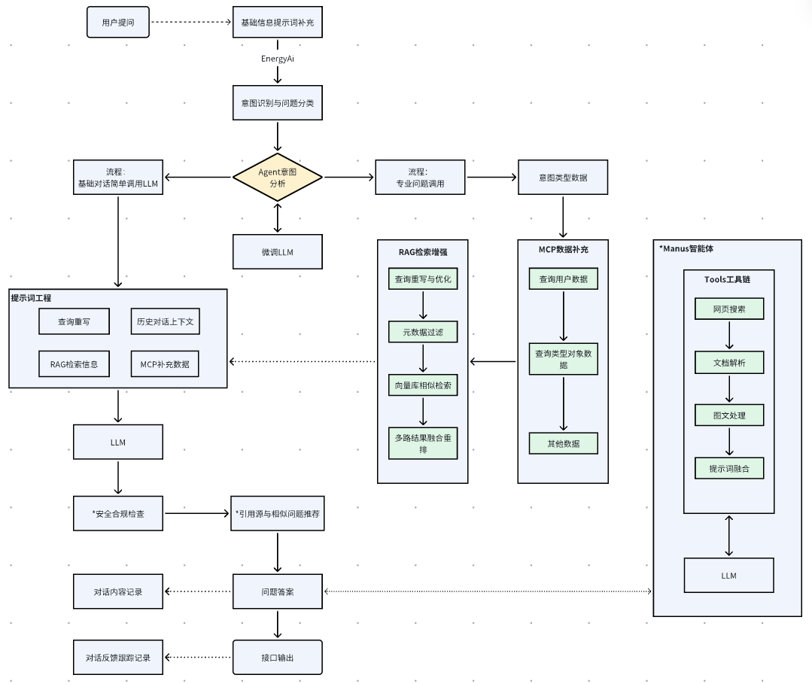  
MCP应用适合于RAG之外的数据增强，作为AI与外部系统的"通用接口"
，实现工具标准化调用，定义MCP功能可以包含例如用户需要获取天气数据、获取节假日信息等等功能，也可用于类似做数据预测前的条件数据查询，如目标温度湿度等时序数据、电网定价信息等等。  
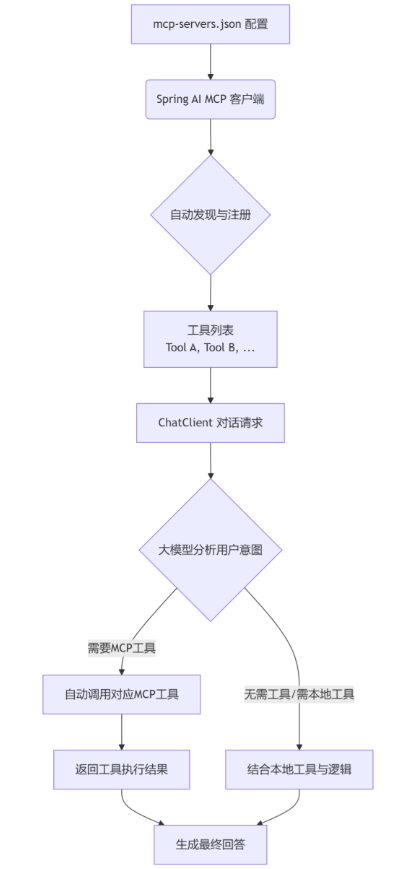

**MCP和Tools的关系**：

- MCP是一种标准化的通信协议，Spring AI通过McpSyncToolCallbackProvider等实现类将MCP协议的工具映射为ToolCallback接口的实现。
- Tools是调用工具的定义，无论底层使用什么协议（MCP、Function Calling等），由LLM意图识别之后框架自动选择调用。
  Tools及MCP定义的要点
- 清晰的工具描述​：@Tool和 @ToolParam的 description务必准确、清晰，这是大模型判断是否调用和如何填参的主要依据。
- 严格的参数模式​：正确定义工具的输入参数以生成框架可读 JSON Schema，确保大模型能生成格式正确的参数。
- 合理的工具设计​：每个工具应功能单一且明确，避免过于复杂的功能，这有助于大模型做出更精准的决策。

## 数据架构设计

数据库文档管理使用的数据库可选，这里使用其他工程已用的MYSQL作为内容管理库，PGSQL作为文档向量库，其中文档支持本地md文档，自定义拓展也可支持其他格式文档。  
工程中数据库支持多数据源。  
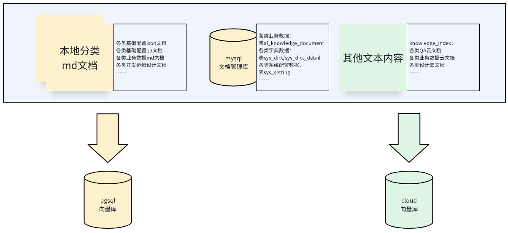  
上述数据云文档为在线文档库的数据管理。实际使用过程中，localVectorStore和pgVectorStore文档向量数据，可能和cloudVectorStore（云知识库）数据存在冲突，为避免维护困难，工程中通过开关实现分开验证。

## 程序架构设计

本项目采用Spring Boot + Spring AI为基础底座，微服务应用的形式管理，支持水平扩容。

* 注册中心采用Nacos/阿里云MSE；
* 配置中心采用Apollo，可自定义按需变更为Nacos；
* 任务调度中心框架xxl-job；
* mysql/pgsql多数据源支持；
* 微服务调用框架支持Dubbo、Feign；
* 微服务熔断工具支持resilience4j。  
  程序架构设计图如下：  
  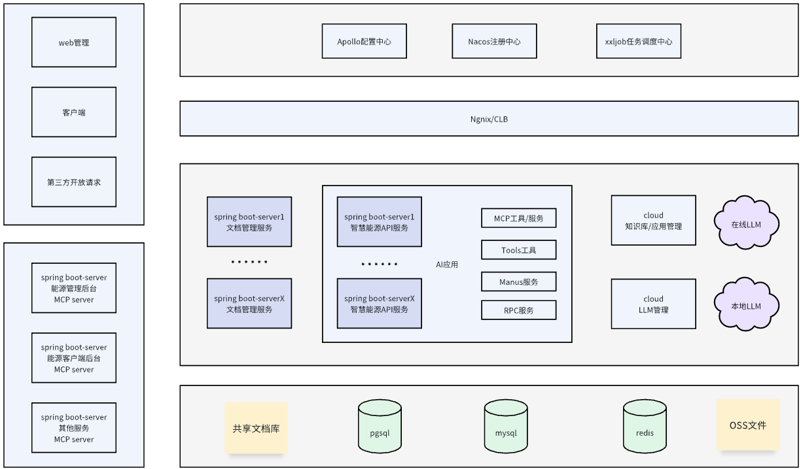

## 工程模块设计

- base-ai-assistant
    - energy-admin-api
      内容信息管理端，如知识库管理、配置管理后端接口等等
    - energy-ai-api
      对外大模型接口和大模型内容服务，核心业务实现模块
    - energy-ai-mcp
      mcp服务定义，本地mcp应用开发，如数据库(特定表)查询，特定库的DSL生成工具等等
    - energy-ai-repository
      各类信息信息持久化模块，包含mysql库、pg库等
    - energy-ai-rpc
      rpc接口定义，提供其他工程服务的调用设计或被调用接口设计，客户端消费端支持dubbo/feign实现
    - service-common
      公共配置服务、工具类和通用信息处理业务
    - service-domain
      领域模型定义模块

## RAG检索增强设计

参考"数据架构设计"，Rag文档来源支持多样化，云知识库文档由云服务自动解析加载向量，这里仅讨论本地文档和知识管理数据库的文档RAG流程。  
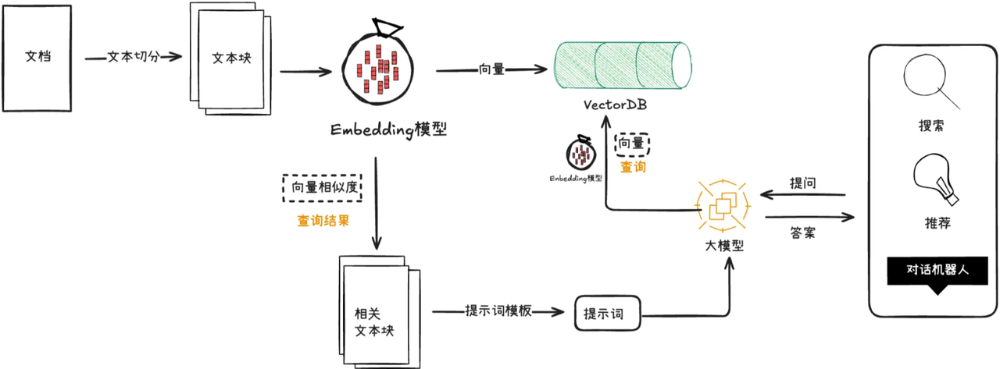

### 文档分割器

定义DocumentTokenTextSplitter初始化文档分割器，分为三种选型实现，本工程使用自定义优化实现。

- 基于固定token范围的TokenTextSplitter分割器，指定token上下浮动分片，英文的文档效果好点，中文文档基本有效；
- 基于语义断句的SentenceSplitter分割器，效果不佳，基于格式严格的英文的文档效果好点，中文文档可用性大打折扣；
- 自定义实现ChineseEnhancedTextSplitter分割器，优化TokenTextSplitter的实现，主要优化标点符号分隔(CHINESE_SEPARATORS参数按需更新)，支持中文更加友好。

### 文档向量库

1. pg向量库PgVectorStore，存储管理后端维护的知识库文档表文档向量数据；
2. 内存向量库SimpleVectorStore，存储指定路径分类或指定resources目录的本地文档向量；
3. 云文档检索库DashScopeDocumentRetriever，针对云文档库文档检索，向量由云文档应用管理；

### 查询改写

查询改写即优化查询的表达形式，提升检索效果，能一定程度提高当前查询的检索召回率和精度，本工程使用QueryTransformer配合ChatModel，定义QueryRewriter，将用户问题文本变更为更易查询的RAG目标参数文本。

### 文档召回配置

配置ai.rag相关参数，实现自定义配置类ChatRagProperties，设定rag参数，默认向量相似度0.6，召回数为3；  
自定义多条件Filter.Expression生成工具，支持多条件的元数据查询。  
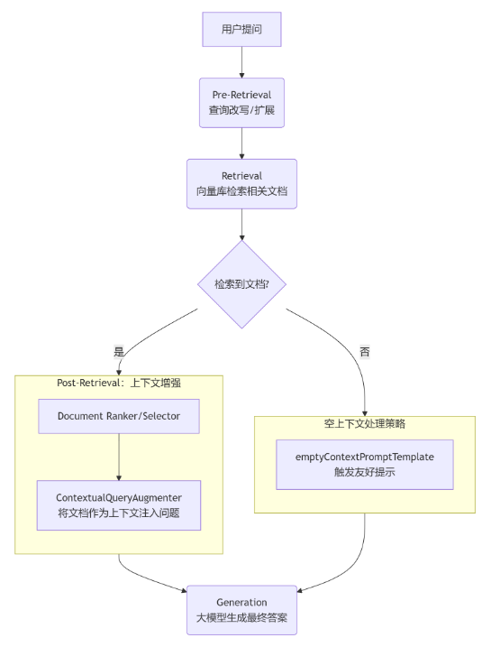

# 架构LLM工具选型

## 大模型

### dashscope大模型

支持定义阿里百炼平台云端模型，可按需更新为其他平台，模型暂选定qwen3-max，按需更新。  
模型token量暂无监控，由运维跟踪。

### ollama本地模型

按需部署需要的模型，验证阶段使用qwen3:8b，本地运行因为涉及硬件配置的考虑，可按需更新。线上基于线上ollama的运行环境，如需要独立部署大模型，可租赁GPU资源，参考阿里团队建议，生产使用部署最少需32b参数及以上的模型。

## 模型微调

在用户问题的意图识别，以及其他分类时，微调模型更加精准和高效，不浪费云端模型token，最重要的是垂直领域做简单分类正是微调模型的强项。  
针对本地的qwen3模型，适当做微调处理，微调方案按需选择，如阿里百炼微调、LLaMA-Factory、ModelScope(swift)等等，一般租借云显卡和环境进行微调。  
微调模型语料可参考各开源datasets，根据格式将内容更新为自己的语料库，语料收集较为繁杂，但是微调必不可少的前期步骤。  
**语料数据集是关键！！！语料数据集是关键！！！语料数据集是关键！！！**

### 使用阿里百炼在线微调

参考 [阿里云模型调优操作](https://bailian.console.aliyun.com/?utm_content=se_1021829474&tab=model#/efm/model_manager?page=1&z_type_=%7B%22page%22%3A%22num%22%7D)

### 使用Swift微调

略，自行参考资料

### 使用LLaMA-Factory微调

略，自行参考资料

## 工具链工具库

AI工作流的执行包含了N个工具的串行或并行任务，大模型根据工具获取到的结果，执行后续操作，最终得到结果。  
优秀的工具库工具，是智能的前提，可使用MCP协议工具或本地工具，其中MCP包含网络发布的MCP或者自定义的MCP工具。  
本工程验证实现的工具参考如下列表，建议按需直接复用网络上其他开发者写好和实践过的工具，进一步减少重复造轮子。

- Pexels API图片搜索（MCP实现）
- 用户信息查询工具（MCP实现，待完善）
- 网页抓取工具
- 终止提示工具
- windows终端操作工具
- 关键词在线搜索工具
- 资源文件下载工具
- PDF生成工具
- 文件读写操作工具
- DeepSeek在线搜索工具
- ……

## MCP框架选择

这里指的是，业务应用服务暴露mcp端点给本AI应用，前者开发mcp服务应该用到的框架。  
市场上存在两个java较为常用的 mcp-server 应用开发框架（ID类，封装后体验都比较简洁）：

- spring-ai-mcp，支持 java17 或以上
- solon-ai-mcp，支持 java8 或以上（也支持集成到 springboot2, jfinal, vert.x 等第三方框架）  
  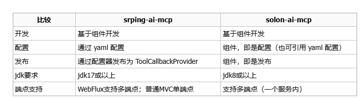  
  solon-ai-mcp的开发相对更简洁，三位一体且支持多端点。业务服务集群创建mcp服务时，应根据jdk版本或具体服务容器进行选择。

### MCP开发特别注意事项

#### 远程mcp的自动注册发现与断线重连

mcp纯sse连接交互不支持断线重连，需要切换为streamable的connection模式，无论是官方文档还是网络参考建议，难以找到完整可用案例，  
经过验证，Spring Ai应用中，需要使用最新spring-ai版本，依赖如下  
solon服务端：

```
<properties>
<maven.compiler.source>8</maven.compiler.source>
<maven.compiler.target>8</maven.compiler.target>
<solon.version>3.6.3</solon.version>
</properties>

<dependencyManagement>
    <dependencies>
        <dependency>
            <groupId>org.noear</groupId>
            <artifactId>solon-parent</artifactId>
            <version>${solon.version}</version>
            <type>pom</type>
            <scope>import</scope>
        </dependency>
    </dependencies>
</dependencyManagement>
````

服务采用streamable，类注解示例：

````
@McpServerEndpoint(channel = McpChannel.STREAMABLE, name = "xxx-mcp-server", mcpEndpoint = "/mcp/sse")
public class McpServerTool implements IMcpServerEndpoint {……}
````

客户端升级spring-ai和spring-alibaba-ai依赖版本，以支持streamable模式

````
<dependency>
<groupId>com.alibaba.cloud.ai</groupId>
<artifactId>spring-ai-alibaba-bom</artifactId>
<version>1.0.0.4</version>
<type>pom</type>
<scope>import</scope>
</dependency>

<dependency>
    <groupId>org.springframework.ai</groupId>
    <artifactId>spring-ai-bom</artifactId>
    <version>1.1.0-M4</version>
    <type>pom</type>
    <scope>import</scope>
</dependency>
````

远程mcp初始化排除异常连接  
如果spring ai应用启动时，远程mcp服务存在异常，服务将直接启动失败，需要改造源码或增强初始化配置，检查远程mcp连接异常则不加入ToolCallbackProvider（mcp工具回调服务）。  
无论是sse模式还是streamable模式，都需要重写配置，以sse为例  
配置更新

````
spring.ai.mcp.client.sse.fix.connections.xxx-mcp-server.url=http://localhost:8004
spring.ai.mcp.client.sse.fix.connections.xxx-mcp-server.endpoint=/mcp/sse
````

配置类更新

````
@Getter
@Data
@Component
@ConfigurationProperties(McpSseConnectionsProperties.CONFIG_PREFIX)
public class McpSseConnectionsProperties {

    public static final String CONFIG_PREFIX = "spring.ai.mcp.client.sse.fix";

    private final Map<String, McpSseClientProperties.SseParameters> connections = new HashMap<>();

}

// 让spring ai使用最新可用的远程mcp配置
@Slf4j
@Configuration
@RequiredArgsConstructor
public class McpSseClientConfig {

    private final McpSseConnectionsProperties mcpSseConnectionsProperties;
    private final McpStreamAbleConnectionsProperties mcpStreamAbleConnectionsProperties;

    @Bean
    @Primary
    public McpSseClientProperties mcpSseClientProperties() {
        McpSseClientProperties mcpSseClientProperties = new McpSseClientProperties();
        Map<String, McpSseClientProperties.SseParameters> connections = mcpSseClientProperties.getConnections();

        Map<String, McpSseClientProperties.SseParameters> existsConnections = mcpSseConnectionsProperties.getConnections();
        if (CollUtil.isEmpty(existsConnections)) {
            return mcpSseClientProperties;
        }
        //检查是否可用
        existsConnections.forEach((name, sseParameters) -> {
            //约定使用默认配置格式 例: url=http://localhost:8004  sse-endpoint=/mcp/sse
            String sseUrl = sseParameters.url() + sseParameters.sseEndpoint();
            try {
                //测试请求是否正常 使用streamable返回400 应该兼容判断
                URL url = new URL(sseUrl);
                HttpURLConnection connection = (HttpURLConnection) url.openConnection();
                connection.setRequestMethod("GET");
                connection.setRequestProperty("Accept", "text/event-stream");
                int responseCode = connection.getResponseCode();
                if (responseCode == HttpURLConnection.HTTP_OK) {
                    connections.put(name, new McpSseClientProperties.SseParameters(sseParameters.url(), sseParameters.sseEndpoint()));
                }
                connection.disconnect();
            } catch (Exception e) {
                log.error(">>>>>> sse-endpoint: " + sseUrl + " get mcp server info error", e.getMessage());
            }
        });

        return mcpSseClientProperties;
    }

}
````

### 远程MCP开发流程

这里由于是在jdk8环境下的springboot工程，只能选择solon作为远程mcp框架；  
也可以简单定义controller接口，在spring ai服务中，手动定义mcp服务（其实就是Function Call），但这种方式违背了远程mcp范式的易用性灵活性可插拔性原则。

1. 参考测试验证的mcp-api工程
2. 定义一个用于端点注册的接口IMcpServerEndpoint
3. 定义个端点实现类如McpServerTool，加入@McpServerEndpoint类注解

````
@McpServerEndpoint(channel = McpChannel.STREAMABLE, name = "xxx-mcp-server", mcpEndpoint = "/mcp/sse")
public class McpServerTool implements IMcpServerEndpoint {

}
````

4. 定义MCP工具实现方法，加入@ToolMapping方法注解和参数@Param注解（solon包）  
   需要啥功能开发啥功能，但ai应用中的提示词以及本处mcp方法注解中的description至关重要，直接影响了spring-ai能否调用的选择。

````
@ToolMapping(name = "getOrderDetail",
                    title = "查询用户订单信息",
                    description = "【关键工具】当用户需要查询任何与充电订单相关的信息时，【必须】调用此工具。\n" +
                    "**调用场景**：包括但不限于：根据订单号查询订单、查询最新订单、根据用户信息查询订单、根据订单号查询订单详情、查询历史订单列表、查询订单状态（如充电中、已完成）、查询订单金额等。\n" +
                    "**触发关键词**：订单、我的订单、最新订单、订单详情、订单状态、充电记录、消费记录。\n" +
                    "**注意**：即使用户的问题比较模糊（例如只问'我最近的订单'或'查一下订单'），只要问题意图与订单相关，就应优先调用本工具获取准确数据，而不是自行回答。",
                    returnDirect = true)
public String getOrderDetail(@Param(description = "订单号，如果用户没有提供订单号则不传该条件，直接查询最新订单", required = false) String orderSeq,
@Param(description = "租户ID或GroupId，用户所属运营商id，该条件非必填", required = false) Long operatorId,
@Param(description = "用户ID，该条件非必填", required = false) Long accountId) {
//test
log.info("####### 触发查询订单详情，参数：orderSeq={}, operatorId={}, accountId={}", orderSeq, operatorId, accountId);
return "test order"; //返回查询到的订单内容;
}
````

_最有效最'智能'的数据查询mcp应该是联动数据库，第一次请求mcp处理动态选择数据表，根据条件生成查询sql；  
然后二次调用mcp，查询目标数据。
涉及数据安全问题，不可用第三方mcp工具，所以自行实践较为困难。_

# 数据结构设计

## 知识文档数据

### 云文档知识库

使用ModeScope的应用加载和检索文档，即线上RAG应用，支持配置模型、元数据配置、文档分割方式等等配置，文档库需专人将知识内容文件化并手动上传和维护文档。  
本工程使用Alibaba Spring Ai作为基础框架，所以默认支持阿里云百炼平台知识库应用。  
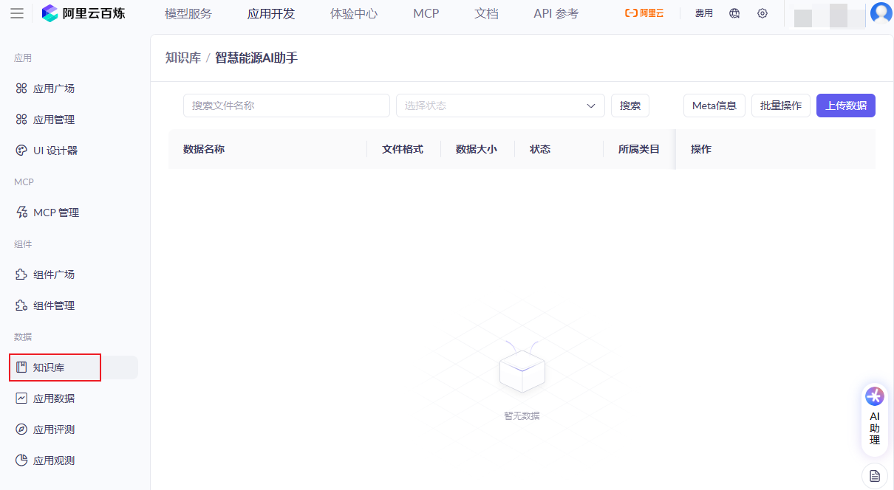

### 本地知识库文档

本地也支持类似dify等rag框架的本地文档管理，实现了工程resources源文件的文档库、指定目录的文档库等实现。  
但局限于文档文件管理的复杂性，以及本系统无需支持过多的文档格式，所以该文档库方式也仅作为参考实现。  
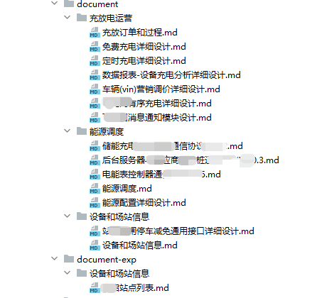

### 数据库知识文档

区别于云知识库以及本地各类格式文件的知识库文档，数据库知识文档数据是文件数据数据库存储的一种形式，更为方便管理，也便于展示和实时维护。  
前端定义支持图文的文档编辑器，将内容存储到后端对应数据表，数据表的每一行数据则对应一份文档。  
该表信息属性中，内容的属性为 content ，文本内容描述，例如某个菜单页面操作指南、某个设计文档全内容或某个章节、某个业务数据信息描述(例如XXX站点信息)等等。  
作为元数据的属性包含：id、scope_type、business_type、group_id、source_type、source_path等，作为元数据过滤或者补充信息展示等。

知识库文档表：ai_knowledge_document  
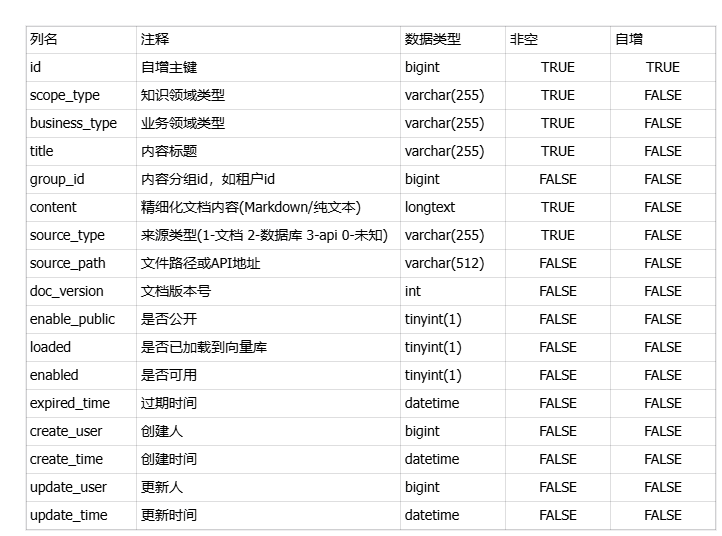  
可按需拓展数据库知识文档属性，或新增其他知识库文档表。

### 对话内容数据

针对用户会话数据的存储，工程应该将用户对话持久化到文档或者数据表中。这里仅描述存储到数据库的对话信息实现的数据格式。
由于上下文相关内容存储会十分冗余，所以不考虑存储rag检索的关联文档内容以及用户上下文信息。  
用户对话记录表：ai_context_user_record  
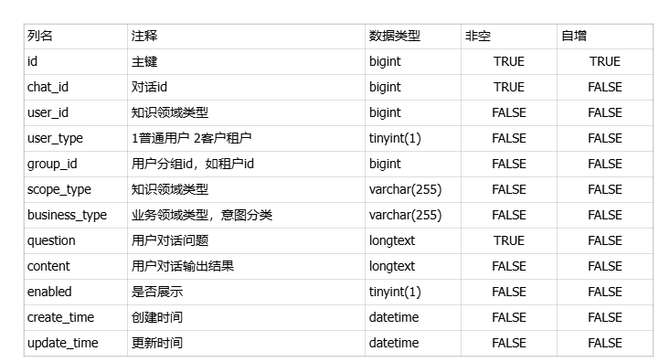

### 向量存储

知识文档向量化存储，用于用户问题使用文本向量相似度检索知识文档关联性查询；  
本工程使用本地结构或者pgsql向量库实现，向量库建表时使用通用的向量数据表结构，Spring AI或其他框架默认定义方式，仅元数据根据平台业务设计差异化区分。  
一份文件知识文档、知识数据表行数据通过内容分割后，可对应多份向量数据。  
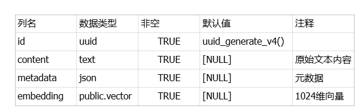

# 资源及部署方案

**本工程基于实际微服务应用集群模式开发，所以不乏较多中间件引用，如dubbo、rabbitmq、apollo、mse/nacos、xxlJob等等，需自行按配置文件提示配置或按需删减工程代码。**

## 数据库sql初始化

### mysql数据库：业务文档内容/对话内容记录

[详见ddl_init_energy_ai.sql](.sql/mysql/init/ddl_init_energy_ai.sql)

### pgsql数据库：文档向量数据

[详见ddl_init_energy_ai.sql](.sql/pgsql/init/ddl_init_energy_ai.sql)

## 工程配置文件

_本工程因配置需要不支持开箱即用，需根据如下内容替换为自己配置后才可正常启动；  
如无需apollo配置，可以注释掉(默认)apollo依赖注解，直接使用properties或yml文件配置，修改工程中配置项即可。_
apollo配置
common公共配置 可在apollo定义 common.properties 作为公共命名空间；
配置部分详见工程代码中的application.properties如下标签部分

````
#################################### common start ####################################
......
#################################### common end ####################################
````

### admin管理端配置

详见本工程admin-api中[application.properties](energy-admin-api/src/main/resources/application.properties)

### AI助手配置

详见本工程admin-api中[application.properties](energy-ai-api/src/main/resources/application.properties)

# 开发设计规范说明

- 遵循阿里巴巴JAVA开发规范

# 工程打包说明

- 本工程或者子模块需使用jdk21打包
- 默认jdk是21时，不需要额外处理，可直接执行package或者install等
- 默认jdk非21时，需指定jdk21的javac路径，针对maven不同执行环境，默认打包指令如下
    - 注意将maven.compiler.executable替换为本机jdk21的javac路径
    - mvn clean package -Dmaven.compiler.executable="D:\env\graalvm-jdk-21.0.5\bin\javac" -Dmaven.compiler.fork=true
- 如果打包失败，则可能是命令行工具不支持上述指令格式，请使用如下方式执行。

## linux默认jdk非21版本时

- export MAVEN_OPTS="-Dmaven.compiler.fork=true -Dmaven.compiler.executable=/opt/graalvm-jdk-21.0.5/bin/javac"
- mvn clean package

## windows-默认jdk非21版本时

### 使用powershell工具

- $env:MAVEN_OPTS = "-Dmaven.compiler.fork=true -Dmaven.compiler.executable=D:/env/graalvm-jdk-21.0.5/bin/javac"
- mvn clean package

### 使用cmd工具

- set MAVEN_OPTS=-Dmaven.compiler.fork=true -Dmaven.compiler.executable="D:/env/graalvm-jdk-21.0.5/bin/javac"
- mvn clean package
