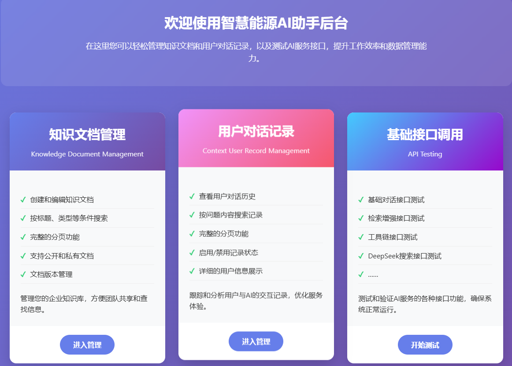
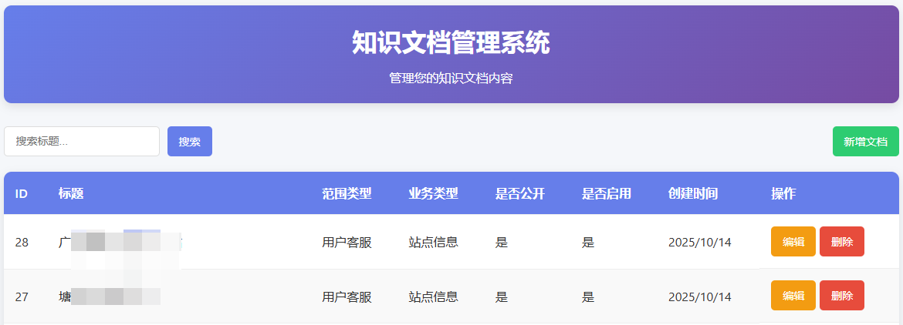
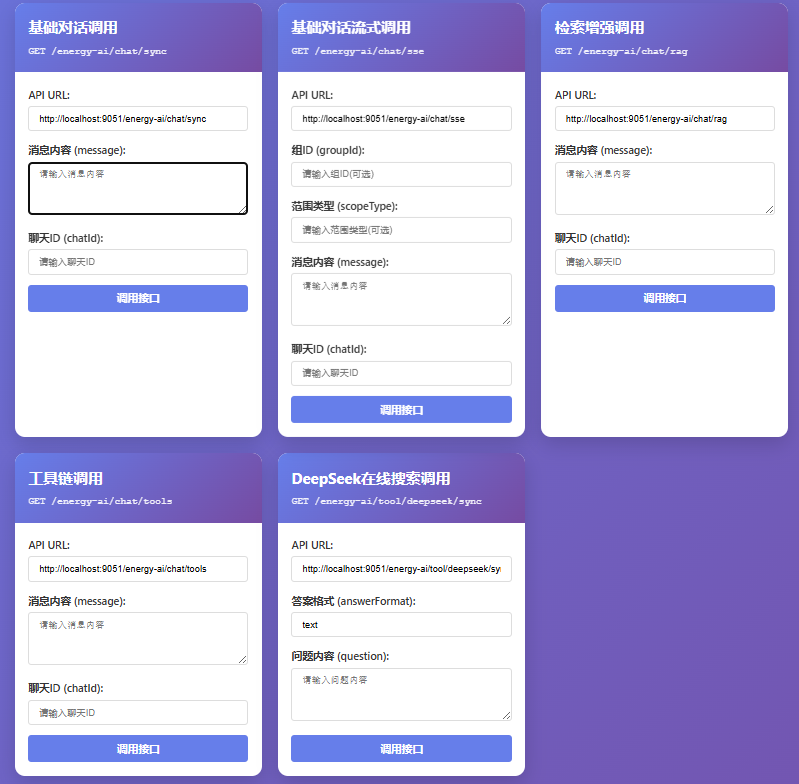
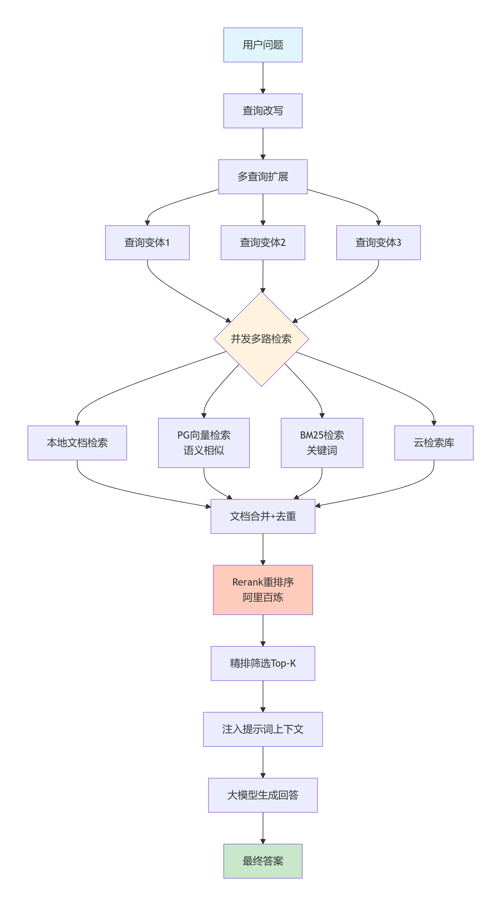

<div align="right">

🌐 [中文](./README.md) | **English**

</div>

# Base AI Assistant Application Framework

<div align="center">

**An Enterprise-Grade RAG Intelligent Assistant Development Framework Built on Spring AI + Spring AI Alibaba**

[](https://openjdk.java.net/)
[](https://spring.io/projects/spring-boot)
[](https://docs.spring.io/spring-ai/reference/)
[](https://sca.aliyun.com/docs/ai/overview/)
[](LICENSE)

[Overview](#-overview) | [Quick Start](#-quick-start) | [Core Features](#-core-features) | [Architecture](#-system-architecture) | [Changelog](#-changelog) | [Deployment Guide](#-deployment-guide)

</div>

---

<div align="center">

### 🌟 If this project helps you, please consider giving it a Star ⭐! Your support keeps me motivated!

</div>

---

## 📖 Overview

### What is base-ai-assistant?

This is an **enterprise-grade AI intelligent assistant development framework** built on Spring Boot 3.3.13, Spring AI, and Spring AI Alibaba.

It addresses the core pain points enterprises face when adopting large language models:

- ❌ **LLM Hallucinations** → ✅ RAG (Retrieval-Augmented Generation) with real enterprise documents
- ❌ **Data Silos** → ✅ MCP protocol integration with business systems for real-time data access
- ❌ **Unspecialized General Models** → ✅ Intent Analysis + domain-specific knowledge bases for vertical expertise
- ❌ **Difficulty in Tool Invocation** → ✅ Standardized toolchain enabling AI to perform real business operations
- ❌ **Inflexible Capability Extension** → ✅ Skill/Command system driven by Markdown files — zero-code capability additions
- ❌ **Context Pollution in Complex Tasks** → ✅ SubAgent with isolated memory for independent task processing

Built on this foundation, you can rapidly construct your own enterprise-grade intelligent customer service, intelligent operations, smart assistants, simple workflows, and vertical-domain agent
applications — all fully extensible to your needs.

### 🎯 Use Cases

| Scenario                           | Typical Use Cases                                                        | Core Value                                                |
|------------------------------------|--------------------------------------------------------------------------|-----------------------------------------------------------|
| **Intelligent Customer Service**   | Product inquiries, after-sales support, FAQ automation                   | 24/7 availability, reduced labor costs                    |
| **Intelligent Operations**         | Operations knowledge retrieval, troubleshooting guidance, manual queries | Fast issue resolution, reduced MTTR                       |
| **Enterprise Knowledge Assistant** | Internal document retrieval, policy queries, training material lookup    | Efficient knowledge utilization, fewer repeated inquiries |
| **Vertical Domain Expert**         | Energy management, EV charging operations, power industry Q&A            | Domain specialization, improved answer quality            |
| **Workflow Automation**            | Multi-tool task execution, data querying and decision-making             | Reduced manual operations, improved efficiency            |

> 💡 **Note**: This project uses "Smart Energy AI Application" as its business context, but the framework design is fully general-purpose. Business domain definitions, package names, data models, and
> more can all be customized to fit different industry scenarios.

---

## 🎬 Demo Screenshots

1. Start the `energy-ai-api` project
2. Start the `energy-admin-api` project and visit: http://localhost:9050/index.html

<div align="center">
<table>
<tr>
<td align="center">
<b>Basic Demo Homepage</b><br/>

</td>
<td align="center">
<b>Document Content Management</b><br/>

</td>
<td align="center">
<b>API Call Verification</b><br/>

</td>
</tr>
</table>
</div>

> **New Admin Features**: Knowledge category configuration management, Token usage statistics, batch document import

---

## ✨ Core Features

### 1. 🧠 Hybrid Retrieval-Augmented Generation (Hybrid RAG)

**Pain Point**: Traditional RAG systems suffer from low recall rates and poor relevance.

**Solution**: Multi-path retrieval + reranking hybrid retrieval architecture
<div align="center">

</div>

**Performance Comparison**:

| Retrieval Method                 | Recall   | Precision | Latency    |
|----------------------------------|----------|-----------|------------|
| Single Vector Retrieval          | 60%      | 70%       | Low        |
| Single Keyword Retrieval         | 50%      | 60%       | Low        |
| **Hybrid Retrieval + Reranking** | **85%+** | **80%+**  | **Medium** |

### 2. 🎯 Intent Analysis-Driven Smart Routing

**Pain Point**: Diverse user question types cannot be served by a single retrieval strategy.

**Solution**: LLM-based intent recognition + intelligent data source routing

```
User Question → Intent Analysis Agent → IntentResult
                                       │
                       ┌───────────────┼───────────────┐
                       ▼               ▼               ▼
               Business Type     Data Source       Tool Chain
               Classification    Prediction        Selection
               (businessType)   (dataScopeList)    (Tools)
                       │               │               │
               ┌───────┴───────┐ ┌─────┴─────┐         │
               ▼               ▼ ▼           ▼         ▼
        EV Charging    Energy Mgmt  Local Docs  DB Docs  MCP Tools
```

Data source types defined by `PossibleSourceTypeEnum`:

- `LOCAL`: Local documents (operations configs, code documentation, platform operation records)
- `VECTOR`: Database documents (customer service FAQs, after-sales tickets, technical consultations)
- `CLOUD`: Alibaba Cloud Bailian Knowledge Base
- `DATABASE`: Business table data (orders, users, site information)
- `UNKNOWN`: Non-business-related questions

**Real-World Results**:

- ✅ EV charging order inquiry → Automatically invokes order query MCP tool
- ✅ Operations manual question → Retrieves local document library
- ✅ Billing strategy question → Retrieves database documents
- ✅ Site information question → Queries business data tables

### 3. 📝 Chinese-Friendly Document Processing

**Pain Point**: English-oriented text splitters handle Chinese poorly, breaking semantic integrity.

**Solution**: Custom `ChineseEnhancedTextSplitter`

| Splitter                      | Principle                                   | Chinese Performance                           |
|-------------------------------|---------------------------------------------|-----------------------------------------------|
| `TokenTextSplitter`           | Fixed token range split                     | ⭐⭐ English-friendly, awkward for Chinese      |
| `SentenceSplitter`            | Semantic sentence break                     | ⭐⭐ English-friendly, poor Chinese recognition |
| `ChineseEnhancedTextSplitter` | Chinese punctuation + semantic optimization | ⭐⭐⭐⭐⭐ **Highly Recommended**                  |

**Key Optimizations**:

- ✅ Supports Chinese punctuation delimiters (，。！？；：etc.)
- ✅ Preserves semantic integrity, avoids abrupt truncation
- ✅ Configurable delimiter set for different scenarios

### 4. 🔄 Flexible Document Management

#### Three Document Source Comparison

| Type            | Storage Method         | Management         | Use Cases                      | Pros                              | Cons                          |
|-----------------|------------------------|--------------------|--------------------------------|-----------------------------------|-------------------------------|
| Local Documents | Filesystem / resources | File upload update | Fixed docs, product manuals    | Simple deployment                 | Repackage needed for updates  |
| DB Documents    | MySQL + PGVector       | Admin UI           | Dynamic content, FAQs, tickets | Real-time updates, traceable      | Database maintenance required |
| Cloud Knowledge | Alibaba Cloud Bailian  | Cloud console      | Large-scale knowledge bases    | Maintenance-free, elastic scaling | Data sovereignty, cost        |

#### Document State Control

```java
// Documents support state control for dynamic vector content updates
status:0-offline  1-online  2-
pending vectorization  3-
vectorization complete
```

- ✅ Document state control: Governs participation in retrieval
- ✅ Incremental updates: Only vectorize changed documents
- ✅ Tenant isolation: Multi-tenant data isolation via `group_id`
- ✅ Multi-level classification: `scope_type` (Knowledge Scope) + `business_type` (Business Domain)

#### Knowledge Category Configuration Management

**Pain Point**: Hard-coded category enums lack flexibility — adding new categories requires code changes.

**Solution**: Database-driven configuration + admin management UI

```sql
-- Knowledge Category Configuration Table
CREATE TABLE ai_knowledge_category_config
(
    id          BIGINT PRIMARY KEY,
    type        VARCHAR(32) COMMENT 'Category type (scope - Knowledge Scope, business - Business Domain)',
    code        VARCHAR(64) COMMENT 'Category code (English identifier)',
    name        VARCHAR(128) COMMENT 'Category name (display name)',
    parent_code VARCHAR(64) COMMENT 'Parent category code',
    description VARCHAR(512) COMMENT 'Category description',
    sort_order  INT COMMENT 'Sort order',
    enabled     TINYINT(1) COMMENT 'Whether enabled'
);
```

**Features**:

- ✅ Dynamic category management: Add, edit, and delete categories
- ✅ Category enable/disable: Control whether categories participate in matching
- ✅ Sort management: Customize category display order
- ✅ Batch document import: Bulk import from filesystem with automatic category matching
- ✅ Admin management UI: Visual operations, no code changes required

### 5. 🔌 MCP Toolchain Extension

**What is MCP?**

MCP (Model Context Protocol) is a standardized communication protocol between AI and external systems, enabling LLMs to invoke external tools for real-time data access.

#### Supported Modes

| Mode                    | Features             | Use Cases                                  |
|-------------------------|----------------------|--------------------------------------------|
| Local MCP               | Tools defined in-app | Simple tools, DB queries                   |
| Remote MCP (SSE)        | Server-Sent Events   | Legacy service exposure                    |
| Remote MCP (Streamable) | HTTP Stream          | **Auto-reconnect, production recommended** |

<div align="left">

</div>

#### Verified Tool Examples

- 🔍 Pexels API image search (MCP implementation)
- 📄 Web scraping tool
- 🔎 DeepSeek online search
- 📊 Business data queries (orders, users, sites/devices)
- 📁 File read/write operations
- 📋 PDF generation tool

#### MCP Tool Development Example

```java

@Component
public class OrderMcpTools {

    @ToolMapping(name = "getOrderDetail",
            title = "Query User Order Information",
            description = """
                    [Critical Tool] When users need to query any charging order-related information,
                    this tool MUST be called.
                    
                    **Invocation Scenarios**:
                    - Query order by order number
                    - Query latest orders
                    - Query orders by user information
                    - Query order status (charging, completed)
                    - Query order amount, etc.
                    
                    **Trigger Keywords**: order, my order, latest order, order details
                    """,
            returnDirect = true)
    public String getOrderDetail(
            @Param(description = "Order number, omit if user hasn't provided one", required = false) String orderSeq,
            @Param(description = "Tenant ID, optional", required = false) Long operatorId,
            @Param(description = "User ID, optional", required = false) Long accountId) {

        // Implementation: query database and return order information
        return orderService.queryOrder(orderSeq, operatorId, accountId);
    }
}
```

**Best Practices**:

- ✅ Tool descriptions should be detailed and accurate, including invocation scenarios and trigger keywords
- ✅ Parameter descriptions should be clear, specifying required vs. optional fields
- ✅ Each tool should have a single, well-defined purpose — avoid "swiss army knife" tools
- ✅ Return value formats should be explicit for easy LLM comprehension

> 💡 **Further Reading**: Beyond MCP tools, the framework also supports **InnerTool pluggable tool registration** (auto-discovery via interface implementation), **Skill system** (Markdown-driven,
> LLM-invoked), and **SubAgent** (isolated memory). See [Core Features 8-12](#-intelligent-conversation-memory-three-layer-compression) below.

### 6. 🌐 Multi-Model Support

#### Cloud Models (DashScope)

```properties
spring.ai.dashscope.api-key=YOUR_DASHSCOPE_API_KEY
spring.ai.dashscope.chat.options.model=qwen3.7-max
# Multimodal support (image + text mixed conversations)
spring.ai.dashscope.chat.options.multi-model=true
# Rerank model configuration
spring.ai.dashscope.rerank.options.model=qwen3-rerank
```

- ✅ Supports all Alibaba Bailian models (qwen3.7-max, qwen-plus, etc.)
- ✅ Supports multimodal LLMs (image + text mixed input)
- ✅ Supports Rerank model upgrade (qwen3-rerank)
- ✅ Supports custom API versions and endpoints
- ✅ Token usage tracking and monitoring by operations teams

#### Local Models (Ollama)

```properties
spring.ai.ollama.base-url=http://localhost:11434
spring.ai.ollama.chat.model=qwen3.6:9b
```

- ✅ Supports locally deployed open-source models
- ✅ Load different models on demand
- ⚠️ 32B+ parameters recommended for production environments

#### Model Fine-Tuning

For intent recognition on user questions and other classification tasks, fine-tuned models are more precise and efficient — they save cloud model tokens, and most importantly, simple classification in
vertical domains is exactly where fine-tuned models excel.

**The corpus dataset is key!!! The corpus dataset is key!!! The corpus dataset is key!!!**

### 7. 📁 Batch Document Import Tool

**Pain Point**: Manually uploading documents one by one is inefficient — large volumes of historical documents need rapid ingestion.

**Solution**: `DocumentImportHelper` batch import tool

**Features**:

- ✅ Recursive directory scanning: Automatically discovers all files under a directory
- ✅ Intelligent category matching: Infers Knowledge Scope and Business Domain from path hierarchy
- ✅ Multiple format support: Markdown (.md/.markdown), plain text (.txt)
- ✅ Deduplication: Path-based detection prevents duplicate imports
- ✅ Encoding compatibility: Auto-detects UTF-8/GBK encoding
- ✅ Batch import result feedback: Success/failure/skip statistics

**Import Example**:

```java
// Batch import documents from a specified directory
BatchImportResult result = documentImportHelper.importFromDirectory(
                "E:/knowledge-base/products",  // directory path
                1001L,                          // tenant ID
                "developer_reference"           // default Knowledge Scope
        );

// Import results
result.

getSuccessCount();  // success count
result.

getFailCount();     // failure count
result.

getSkipCount();     // skip count (already exists)
```

**Intelligent Category Matching Logic**:

```
File path: /Knowledge Docs/User Service/Charging Orders/Manual.md

Matching process:
1. "User Service" → matches scopeTypeNameMap → "account_customer_service"
2. "Charging Orders" → matches businessTypeNameMap → "charge_order"
3. Result: scopeType="account_customer_service", businessType="charge_order"
```

> 💡 **Tip**: Category matching is based on the database configuration table `ai_knowledge_category_config`, which supports runtime adjustment of matching rules.

---

## 🏗️ System Architecture

### Overall Workflow Design

From user question to answer output, the process involves intent analysis, MCP data enrichment, RAG retrieval augmentation, prompt engineering, and LLM invocation. The complete workflow is shown
below:

<div align="center">

</div>

MCP applications are suited for data augmentation beyond RAG — acting as a "universal interface" between AI and external systems, enabling standardized tool invocation. MCP capabilities can include
weather data retrieval, holiday information queries, and more. They can also be used for conditional data queries before predictive tasks, such as retrieving time-series data (target temperature,
humidity, etc.) or grid pricing information.

<div align="center">

</div>

**Relationship Between MCP and Tools**:

- MCP is a standardized communication protocol. Spring AI maps MCP protocol tools to `ToolCallback` interface implementations via classes like `McpSyncToolCallbackProvider`.
- Tools are tool invocation definitions. Regardless of the underlying protocol (MCP, Function Calling, etc.), the framework automatically selects and invokes the appropriate tool after LLM intent
  recognition.

**Key Points for Tool & MCP Definitions**:

- Clear tool descriptions: The `description` fields in `@Tool` and `@ToolParam` must be accurate and clear — this is the primary basis for the LLM to decide whether to invoke and how to fill
  parameters.
- Strict parameter schemas: Correctly define tool input parameters to generate framework-readable JSON Schemas, ensuring the LLM produces correctly formatted arguments.
- Sound tool design: Each tool should have a single, clear purpose. Avoid overly complex functionality — this helps the LLM make more precise decisions.

### Data Architecture Design

For database document management, MySQL serves as the content management database and PostgreSQL (with PGVector) serves as the document vector store. Documents support local Markdown files, and custom
extensions can support other formats. The project supports multi-datasource configurations.

<div align="center">

</div>

The cloud documents above refer to online document library data management. In practice, `localVectorStore` and `pgVectorStore` document vector data may conflict with `cloudVectorStore` (cloud
knowledge base) data. To avoid maintenance difficulties, the project uses toggles to validate them separately.

### Application Architecture Design

This project uses Spring Boot + Spring AI as its foundation, managed as a microservice application with horizontal scaling support.

- Service registry: Nacos / Alibaba Cloud MSE
- Configuration center: Apollo (customizable — can switch to Nacos)
- Task scheduling framework: xxl-job
- Multi-datasource support: MySQL / PostgreSQL
- Microservice invocation: Dubbo, Feign
- Circuit breaker: Resilience4j

<div align="center">

</div>

### Project Module Design

```
base-ai-assistant/
├── energy-admin-api/          # Admin Console (knowledge base management, configuration, etc.)
├── energy-ai-api/             # Core Service (RAG, Agent, MCP implementation)
├── energy-ai-mcp/             # MCP Service Definitions
├── energy-ai-repository/      # Data Persistence (MySQL, PGVector)
├── energy-ai-rpc/             # RPC Interface Definitions (Dubbo/Feign)
├── service-common/            # Common Services (configuration, utilities)
└── service-domain/            # Domain Model Definitions
```

### RAG Retrieval-Augmented Design

Referencing the "Data Architecture Design" above, RAG document sources are diverse. Cloud knowledge base documents are automatically parsed and vectorized by the cloud service. Here we focus on the
RAG workflow for local documents and knowledge management database documents.

<div align="center">

</div>

### Document Vector Stores

1. **PG Vector Store (PgVectorStore)**: Stores document vector data from the knowledge base documents maintained in the admin backend
2. **In-Memory Vector Store (SimpleVectorStore)**: Stores local document vectors from specified paths or `resources` directories
3. **Cloud Document Retriever (DashScopeDocumentRetriever)**: For cloud document library retrieval — vectors managed by the cloud document application

### Document Retrieval Configuration

Configure `ai.rag` parameters via a custom configuration class `ChatRagProperties` to set RAG parameters. The default vector similarity threshold is 0.6 with a top-K of 3. Includes a custom
multi-condition `Filter.Expression` builder supporting multi-criteria metadata queries.

<div align="center">

</div>

---

## 🗄️ Data Structure Design

### Cloud Document Knowledge Base

Uses ModelScope applications to load and retrieve documents (i.e., online RAG applications). Supports model configuration, metadata settings, document splitting strategies, and more. The document
library requires dedicated personnel to convert knowledge content into files and manually upload and maintain them.

<div align="center">

</div>

### Local Knowledge Base Documents

Local document management similar to Dify and other RAG frameworks is also supported, with implementations for `resources` source file libraries and specified directory document libraries.

<div align="center">

</div>

### Database Knowledge Documents

Unlike cloud knowledge bases and local file-based knowledge documents, database knowledge documents are stored in database tables — a format that is easier to manage, display, and maintain in
real-time.

Knowledge document table: `ai_knowledge_document`

<div align="center">

</div>

### Conversation Content Data

For user session data storage, the project persistsists user conversations to files or database tables. Here we describe the data format for conversations stored in the database.

User conversation record table: `ai_context_user_record`

<div align="center">

</div>

### Vector Storage

Knowledge document vectorization storage, used for text embedding similarity retrieval of knowledge document relevance when users ask questions.

<div align="center">

</div>

---

## 🚀 Quick Start

### Prerequisites

| Component  | Version | Description                                   |
|------------|---------|-----------------------------------------------|
| JDK        | 21+     | **Required**                                  |
| Maven      | 3.6+    | Build tool                                    |
| MySQL      | 8.0+    | Business database                             |
| PostgreSQL | 14+     | Vector database (requires pgvector extension) |
| Redis      | -       | Optional (session cache)                      |

### 1. Clone the Project

```bash
git clone https://github.com/your-org/base-ai-assistant.git
cd base-ai-assistant
```

### 2. Database Initialization

#### MySQL Initialization

```bash
# Base table creation
mysql -u root -p < .sql/mysql/init/ddl_init_energy_ai.sql
# Incremental migration (run when upgrading existing environments)
mysql -u root -p < .sql/mysql/20260611/ddl_alter_knowledge_document.sql
```

Creates business tables: knowledge document table, conversation record table, etc. Existing environments need to additionally run the migration scripts.

#### PGVector Initialization

```bash
# First install the pgvector extension
psql -U postgres -d energy_ai -c "CREATE EXTENSION IF NOT EXISTS vector;"
psql -U postgres -d energy_ai < .sql/pgsql/init/ddl_init_energy_ai.sql
# (Optional) Install pg_jieba Chinese word segmentation extension for BM25 full-text retrieval scoring
psql -U postgres -d energy_ai < .sql/pgsql/init/ddl_init_energy_ai_jieba.sql
```

Creates vector tables with HNSW indexes and BM25 full-text indexes.

### 3. Configuration

The project provides two configuration files:

| File                                  | Purpose                                         | Committed to Repo    |
|---------------------------------------|-------------------------------------------------|----------------------|
| `application.properties`              | Local runtime config with real connection data  | ❌ No (in .gitignore) |
| `application-desensitized.properties` | Desensitized full config template for reference | ✅ Yes                |

> 💡 On first use, copy `application-desensitized.properties` to `application.properties`, then replace the placeholders with your actual values.

#### 3.1 Required Configuration

Edit `energy-ai-api/src/main/resources/application.properties`:

```properties
# ========================================
# LLM Configuration (Required)
# ========================================
spring.ai.dashscope.api-key=YOUR_DASHSCOPE_API_KEY
spring.ai.dashscope.chat.options.model=qwen3.7-plus
# Multimodal support (enable for image + text mixed conversations)
spring.ai.dashscope.chat.options.multi-model=true
# Rerank model
spring.ai.dashscope.rerank.options.model=qwen3-rerank
# ========================================
# Database Configuration (Required)
# ========================================
# MySQL Configuration
spring.datasource.mysql.host=localhost
spring.datasource.mysql.port=3306
spring.datasource.druid.username=root
spring.datasource.druid.password=YOUR_PASSWORD
# PostgreSQL Configuration
spring.datasource.pgsql.host=localhost
spring.datasource.pgsql.port=5432
spring.datasource.pgsql.username=postgres
spring.datasource.pgsql.password=YOUR_PASSWORD
# ========================================
# RAG Configuration (Recommended)
# ========================================
ai.rag.similarity-threshold=0.6
ai.rag.top-k=3
ai.rag.rerank-api-key=YOUR_RERANK_API_KEY
ai.rag.enable-intent-analysis=true
# ========================================
# MCP Configuration (Optional)
# ========================================
spring.ai.mcp.server.enabled=true
spring.ai.mcp.client.enabled=true
```

#### 3.2 Runtime Mode Selection

The project supports **Standalone Mode** and **Microservice Mode**, controlled by a single toggle:

```properties
# ========================================
# Runtime Mode (choose one)
# ========================================
# Standalone Mode (default) — No Dubbo/Nacos/Feign required, runs locally
ai.rpc.enabled=false
# Microservice Mode — Enables Dubbo + Nacos service registry + Feign remote calls
# ai.rpc.enabled=true
# When enabled, additional configuration is required:
# dubbo.registry.address=nacos://your-nacos-ip:8848
# spring.cloud.nacos.discovery.server-addr=your-nacos-ip:8848
```

| Config Item        | `ai.rpc.enabled=false`                                               | `ai.rpc.enabled=true`             |
|--------------------|----------------------------------------------------------------------|-----------------------------------|
| Dubbo Registration | ❌ Not registered                                                     | ✅ Registered to Nacos             |
| Feign Remote Calls | ❌ Not enabled                                                        | ✅ Enabled                         |
| Nacos Discovery    | ❌ Not connected                                                      | ✅ Connected and registered        |
| Use Case           | Local development, single-server deployment, open-source exploration | Production, microservice clusters |

### 4. Build

#### Option 1: Default JDK 21

```bash
mvn clean package -DskipTests
```

#### Option 2: Specify Java 21 Compiler

**Windows PowerShell:**

```powershell
$env:MAVEN_OPTS = "-Dmaven.compiler.fork=true -Dmaven.compiler.executable=D:/env/graalvm-jdk-21.0.5/bin/javac"
mvn clean package -DskipTests
```

**Linux:**

```bash
export MAVEN_OPTS="-Dmaven.compiler.fork=true -Dmaven.compiler.executable=/opt/graalvm-jdk-21/bin/javac"
mvn clean package -DskipTests
```

### 5. Start Services

#### Option 1: IDE Launch (Recommended for Development & Debugging)

1. Ensure JDK 21 is configured
2. Run `AiApiApplication.main()` in your IDE to start the core AI service (port 9051)
3. Run `AdminApiApplication.main()` in your IDE to start the admin console (port 9050)

#### Option 2: Command Line Launch

```bash
# Build first
mvn clean package -DskipTests

# Start the core AI service (required)
java -jar energy-ai-api/target/energy-ai-api-1.0.0.jar

# Start the admin console (optional)
java -jar energy-admin-api/target/energy-admin-api-1.0.0.jar
```

#### Option 3: Launch with Specific Profile

```bash
# Launch with a specific profile (e.g., application-dev.properties)
java -jar energy-ai-api/target/energy-ai-api-1.0.0.jar --spring.profiles.active=dev
```

> ⚠️ **Startup Order**: Start `energy-ai-api` (core service) first, then `energy-admin-api` (admin console depends on the core service)

### 6. Verify Access

| Service        | URL                                       | Description                                             |
|----------------|-------------------------------------------|---------------------------------------------------------|
| Admin Console  | http://localhost:9050/index.html          | Knowledge base management, category config, Token stats |
| AI Service API | http://localhost:9051/energy-ai/chat/sync | Synchronous Q&A endpoint                                |
| AI Service SSE | http://localhost:9051/energy-ai/chat/sse  | Streaming Q&A endpoint                                  |
| MCP Endpoint   | http://localhost:9051/mcp                 | MCP tool service endpoint                               |

---

## 📋 Deployment Guide

### Production Environment Recommendations

#### 1. Model Selection

| Scenario         | Recommended Model          | Description                      |
|------------------|----------------------------|----------------------------------|
| Online RAG       | qwen3.7-max / qwen3.7-plus | Best results, higher cost        |
| Intent Analysis  | qwen3.6 9b (fine-tuned)    | Precise classification, low cost |
| Local Deployment | qwen3.6:35b+               | Requires GPU resources           |

#### 2. Vector Database Configuration

```properties
# PGVector Connection Configuration
spring.ai.vectorstore.pgvector.dimensions=1024
spring.ai.vectorstore.pgvector.distance-type=COSINE_DISTANCE
spring.ai.vectorstore.pgvector.index-type=HNSW
# HNSW Index Parameters (adjust based on data volume)
# m=16, efConstruction=64 suitable for millions of vectors
```

#### 3. RAG Parameter Tuning

```properties
# Similarity threshold (adjust based on actual results)
ai.rag.similarity-threshold=0.6      # Minimum vector retrieval similarity
ai.rag.bm25-similarity-threshold=0.4 # Minimum BM25 retrieval similarity
# Retrieval count
ai.rag.top-k=3          # Vector retrieval Top-K
ai.rag.bm25-top-k=5     # BM25 retrieval Top-K
# Rerank Configuration
ai.rag.rerank-min-score=0.1  # Minimum rerank score
ai.rag.rerank-model-name=ai-rerank
# Rerank model (qwen3-rerank recommended)
spring.ai.dashscope.rerank.options.model=qwen3-rerank
# Multimodal support (image + text mixed conversations)
spring.ai.dashscope.chat.options.multi-model=true
```

### Configuration Center Integration

#### Apollo Configuration Example

```properties
# ========================================
# Common Configuration
# ========================================
# LLM Configuration
spring.ai.dashscope.api-key=${DASHSCOPE_API_KEY}
spring.ai.dashscope.chat.options.model=qwen3.7-max
spring.ai.dashscope.chat.options.multi-model=true
spring.ai.dashscope.rerank.options.model=qwen3-rerank
# RAG Configuration
ai.rag.similarity-threshold=0.6
ai.rag.top-k=3
ai.rag.rerank-api-key=${RERANK_API_KEY}
# Database Configuration
spring.datasource.druid.url=jdbc:mysql://${DB_HOST}:3306/energy_ai
spring.datasource.pgsql.url=jdbc:postgresql://${PG_HOST}:5432/energy_ai
# MCP Configuration
spring.ai.mcp.server.enabled=true
spring.ai.mcp.client.enabled=true
```

---

## 🔧 Development Guide

### Custom Toolchain

```java

@Component
public class CustomTools {

    @Tool(description = "Query user account balance", name = "getAccountBalance")
    public String getAccountBalance(
            @ToolParam(description = "User ID") Long userId
    ) {
        // Implementation logic
        return balance;
    }

    @Tool(description = "Generate PDF report", name = "generatePdfReport")
    public String generatePdfReport(
            @ToolParam(description = "Report content") String content,
            @ToolParam(description = "Report title") String title
    ) {
        // Implementation logic
        return pdfPath;
    }
}
```

### Custom Document Splitter

```java

@Bean
public DocumentSplitter customDocumentSplitter() {
    return new ChineseEnhancedTextSplitter(
            TokenTextSplitter.builder()
                             .maxTokens(512)
                             .minTokens(128)
                             .separators(CHINESE_SEPARATORS) // Chinese separators
                             .build()
    );
}
```

### Extending Intent Types

```java
public enum PossibleSourceTypeEnum {
    LOCAL("Local Documents", "Operations configs, code documentation, etc."),
    VECTOR("DB Documents", "Customer service FAQs, after-sales tickets, etc."),
    CLOUD("Cloud Knowledge Base", "Alibaba Cloud Bailian Knowledge Base"),
    DATABASE("Business Table Data", "Orders, users, site information"),
    UNKNOWN("Unknown", "Non-business-related questions");
}
```

---

## ❓ FAQ

### Q1: Compilation error "invalid flag: --release"

**Cause**: Using Java 8 compiler; the project requires Java 21.

**Solution**: Specify the Java 21 compiler path

```bash
export MAVEN_OPTS="-Dmaven.compiler.fork=true -Dmaven.compiler.executable=/path/to/java21/bin/javac"
mvn clean package
```

### Q2: RerankModel Bean creation fails

**Cause**: `RerankModel` is an interface; Spring AI Alibaba provides auto-configuration.

**Solution**: Ensure the API Key is configured so auto-configuration takes effect

```properties
spring.ai.dashscope.rerank.api-key=YOUR_RERANK_API_KEY
```

### Q3: Vector retrieval results are inaccurate

**Tuning Recommendations**:

1. Check the document splitter configuration to ensure reasonable chunk sizes
2. Adjust the similarity threshold (default 0.6 → try 0.5 or 0.7)
3. Increase the retrieval count (top-k from 3 to 5)
4. Ensure the Rerank API Key is correctly configured
5. Check document metadata filter conditions

### Q4: Remote MCP connection fails

**Checklist**:

- [ ] Is the MCP server running?
- [ ] Is the connection URL correct?
- [ ] Using Streamable mode (supports auto-reconnect)
- [ ] Connection health check is configured
- [ ] Firewall allows the port

### Q5: Excessive Dubbo logs on startup / No Nacos but still want to start

**Cause**: The project depends on Dubbo/Spring Cloud components. Related JARs on the classpath trigger automatic initialization.

**Solution**: Ensure `ai.rpc.enabled=false` in `application.properties` (already disabled by default).

Dubbo will still silently initialize (printing its Banner), but it will not register any services, connect to a registry, or expose any ports — no impact on runtime behavior.

### Q6: What is the relationship between `application.properties` and `application-desensitized.properties`?

| File                                  | Description                                                                           | Committed |
|---------------------------------------|---------------------------------------------------------------------------------------|-----------|
| `application.properties`              | Local runtime config with real connection data                                        | ❌ No      |
| `application-desensitized.properties` | Desensitized full config template — same structure, values replaced with placeholders | ✅ Yes     |

On first use, copy `application-desensitized.properties` to `application.properties` and replace the placeholders. Open-source contributors only need to modify `application-desensitized.properties`
and sync changes to `application.properties`.

---

### 8. 🧠 Intelligent Conversation Memory (Three-Layer Compression)

**Pain Point**: Long conversations lead to massive token consumption and context window overflow.

**Solution**: `SmartChatMemory` three-tier progressive context compression strategy

| Layer   | Strategy            | Principle                                                                            | Effect                    |
|---------|---------------------|--------------------------------------------------------------------------------------|---------------------------|
| Layer 1 | Summary Compression | When history > 16 messages, auto-compresses earlier messages into a 300-word summary | Preserves key information |
| Layer 2 | Assistant Trimming  | Keeps only the last 3 Assistant responses                                            | Precise token savings     |
| Layer 3 | Sliding Window      | When messages > 40, discards the earliest messages                                   | Hard limit protection     |

**Core Design**:

- Cohesive & transparent: Compression logic is fully encapsulated within `get()` — callers are unaware
- Incremental compression: New compression merges old summaries with new conversations, preventing information loss
- TOOL message protection: Truncation automatically avoids TOOL messages to preserve tool-call context

```java

@Bean("smartChatMemory")
public SmartChatMemory smartChatMemory() {
    ChatClient summaryChatClient = ChatClient.builder(dashscopeChatModel).build();
    return new SmartChatMemory(summaryChatClient);
}
```

### 9. 🔌 Pluggable Tool Registration (InnerTool)

**Pain Point**: Adding new tools requires modifying registration code, violating the Open/Closed Principle.

**Solution**: `InnerTool` interface + auto-discovery mechanism

```java
// Implement the InnerTool interface for automatic registration at startup
@Component
public class MyCustomTool implements InnerTool {
    @Override
    public List<ToolCallback> loadToolCallbacks() {
        return List.of(
                FunctionToolCallback.builder("my_tool", this::myMethod)
                                    .description("My tool description")
                                    .build()
        );
    }
}
```

### 10. 🎭 Skill System (LLM-Invoked)

**Pain Point**: Adding new Prompt templates requires code changes and redeployment.

**Solution**: Markdown file-driven skill system — LLM autonomously decides whether to invoke

**Skill File Format** (`resources/skill/xxx.md`):

```markdown
---
name: summarize
description: Summarize and condense the text content provided by the user
---

Please summarize the following text, extracting the key points:

{{input}}
```

At startup, `classpath:skill/*.md` files are automatically scanned and registered as `ToolCallback`s. The LLM autonomously decides whether to invoke based on the `description`.

### 11. ⌨️ Command System (User-Invoked)

**Pain Point**: Users need quick command entry points to explicitly specify operations to execute.

**Solution**: Pure Prompt template files — users invoke commands by name via REST API

**Command File Format** (`resources/command/xxx.md`):

```markdown
Please perform a code review on the following code, providing improvement suggestions from the perspectives of code quality, potential bugs, and performance:

{{input}}
```

**API Invocation**:

```bash
curl -X POST http://localhost:9051/api/command/execute \
  -H "Content-Type: application/json" \
  -d '{"command": "code_review", "input": "public void foo() {...}"}'
```

**Key Differences Between Skill and Command**:

| Dimension          | Command                           | Skill                                      |
|--------------------|-----------------------------------|--------------------------------------------|
| File Format        | Pure Prompt template              | Front Matter + Prompt                      |
| Invoked By         | User explicitly                   | LLM autonomously                           |
| Registered as Tool | ❌ No                              | ✅ Yes, as ToolCallback                     |
| Use Case           | User knows exactly what they need | LLM intelligently decides based on context |

### 12. 🤖 SubAgent (Isolated Memory)

**Pain Point**: Complex tasks need independent context and should not pollute the main conversation memory.

**Solution**: SubAgent system with independent ChatMemory

```
Main Agent Conversation ──┐
                          ├── Fully Isolated ── Main conversation history
SubAgent-1 ───────────────┤
                          ├── Fully Isolated ── SubAgent-1 independent history
SubAgent-2 ───────────────┘
                          ├── Fully Isolated ── SubAgent-2 independent history
```

Exposed to the main Agent via 3 tools, with LLM-driven autonomous decisions:

- `create_sub_agent`: Create a SubAgent and execute the first task
- `chat_with_sub_agent`: Continue conversation with an existing SubAgent
- `destroy_sub_agent`: Destroy the SubAgent and release resources

---

## 📝 Pending Features

- [√] Intent Analysis Agent — full implementation (user question → business classification → tool selection)
- [√] Complete workflow orchestration
- [√] Conversation history persistence (Redis/database)
- [√] Token usage monitoring and statistics
- [√] Intelligent conversation memory (three-layer compression: summary + Assistant trimming + sliding window)
- [√] Pluggable tool registration (InnerTool interface + auto-discovery)
- [√] Skill system (Markdown-driven, LLM-invoked)
- [√] Command system (Markdown-driven, user-invoked)
- [√] SubAgent (isolated memory)
- [√] Query rewriting retriever (LLM-rewritten multi-path recall + RRF fusion)
- [√] Multimodal LLM support (image + text mixed conversations)
- [√] Rerank model upgrade (qwen3-rerank)
- [√] Streaming Q&A support (SSE + Token usage tracking)
- [√] API authentication interceptor
- [√] Document vector matching recommendations
- [ ] Business data MCP tools (on-demand extensions for order queries, user info, and other database interactions)
- [ ] Dynamic SQL generation MCP (natural language → SQL queries)

---

## 📋 Changelog

### v1.1.0 (2026-06-11) — Feature Expansion & Architecture Enhancement

#### 🚀 New Features

- **Streaming Q&A & Token Tracking**: Added `EnergyAiDocumentApp` with SSE streaming output; `PromptLoggerAdvisor` rewritten to create per-request instances with automatic
  promptTokens/completionTokens tracking
- **Unified Request Management**: Added `AiRequestManager` to unify synchronous/streaming Q&A, RAG document matching, simple conversation, and other request entry points
- **Document Match Recommendations**: Added `KnowledgeDocumentManager` for vector similarity-based document matching with confidence scoring
- **API Authentication Interceptor**: Added `SimpleAuthInterceptor` for Token verification on `/api/**` paths with configurable whitelist
- **Global Exception Handling**: Added `GlobalExceptionHandler` for unified handling of authentication errors, business exceptions, connection interruptions, etc.
- **BM25 Full-Text Retrieval**: Added `computeContentScore` SQL support for pg_jieba Chinese word segmentation scoring
- **simpleChatClient**: Added lightweight ChatClient Bean containing only the Memory Advisor for simple scenarios
- **multiQueryExpander**: Added multi-query expansion Bean for query expansion to improve recall

#### ⚡ Enhancements

- **Dependency Upgrades**: Spring AI 1.1.0-M4 → **1.1.7**, Spring AI Alibaba 1.0.0.4 → **1.1.2.3**, DashScope SDK 2.19.1 → **2.22.20**, LangChain4J 1.0.0-beta2 → **1.16.0-beta26**, OpenAI Java SDK
  3.7.1 → **4.39.1**
- **Multimodal Support**: Added `spring.ai.dashscope.chat.options.multi-model=true` configuration for image + text mixed conversations
- **Rerank Model Upgrade**: Added `spring.ai.dashscope.rerank.options.model=qwen3-rerank` configuration for next-generation reranking model
- **VectorStoreManager Enhancements**: Document loading switched to paginated mode (prevents OOM), added incremental single-document vector updates, added document vector deletion, automatic document
  content concatenation with titles for improved retrieval quality
- **EnergyAiConstant Prompt Enhancements**: Added 6 intent analysis/RAG recommendation prompt templates with structured output support
- **ChatClientAdvisorFactory Refactoring**: `PromptLoggerAdvisor` changed from singleton to factory method per-request creation, fixing concurrency safety issues
- **Repository Layer Enhancements**: `KnowledgeDocumentService` added paginated loading, status update returns int, cascading vector operations; `VectorStoreService` added BM25 scoring method
- **RPC DTO Additions**: Added 18 request/response DTO classes (AIStreamResponse, KnowledgeAIQueryParam, etc.) supporting streaming Q&A endpoints

#### 🐛 Bug Fixes

- **RAG Multi-Turn Conversation History Loss**: Fixed `EnergyAiApp.doChatWithRag()` not passing `existingMessages`, causing multi-turn conversations to lose context
- **EnergyManus Reference Failure**: Updated `getPromptLoggerAdvisor()` to `createPromptLoggerAdvisor(null)` to match the refactored factory method

#### 📦 SQL Changes

- Added `.sql/mysql/20260611/ddl_alter_knowledge_document.sql`: Added `doc_id` field and index to `ai_knowledge_document`
- Added `.sql/pgsql/init/ddl_init_energy_ai_jieba.sql`: pg_jieba Chinese word segmentation extension (tsvector column + GIN index + auto-update trigger)
- Added `.sql/mysql/20260318/dml_knowledge_category_config.sql`: Initial knowledge category data

#### 🏗️ Architecture Optimization

- `PossibleSourceTypeEnum` migrated to `service-domain` module for unified management with other domain enums
- MQ consumer queue names switched to `MQConstant` constant references, replacing hardcoded strings
- `KnowledgeCategoryConfigService` cache keys unified to `CACHE_KEY` constant
- `GlobalConstant` added document metadata key constants (`DOC_ID_MARK`, `DOC_TITLE_MARK`, etc.)

### v1.0.0 (2025-11-11) — Initial Release

- Hybrid RAG retrieval augmentation (Vector + BM25 + Cloud Knowledge Base + Reranking)
- Intent Analysis Agent + intelligent data source routing
- MCP protocol support (Local / Remote SSE / Streamable)
- Skill/Command system + SubAgent
- Intelligent conversation memory with three-layer compression
- Token usage monitoring and statistics
- Admin console (knowledge document management, category configuration, Token statistics)

---

## 🤝 Contributing

Issues and Pull Requests are welcome!

1. Fork this repository
2. Create a feature branch (`git checkout -b feature/0318-amazing-feature`)
3. Commit your changes (`git commit -m 'feat-0318: Add some amazing feature'`)
4. Push to the branch (`git push origin feature/0318-amazing-feature`)
5. Open a Pull Request

---

## 📄 License

Apache License 2.0

---

## 🙏 Acknowledgments

- [Spring AI](https://docs.spring.io/spring-ai/reference/)
- [Spring AI Alibaba](https://sca.aliyun.com/docs/ai/overview/)
- [Alibaba Cloud Bailian](https://bailian.console.aliyun.com/)
- [Ollama](https://ollama.ai/)
- [MyBatis Plus](https://baomidou.com/)

---

<div align="center">

**Made with ❤️ for Enterprise AI**

</div>
